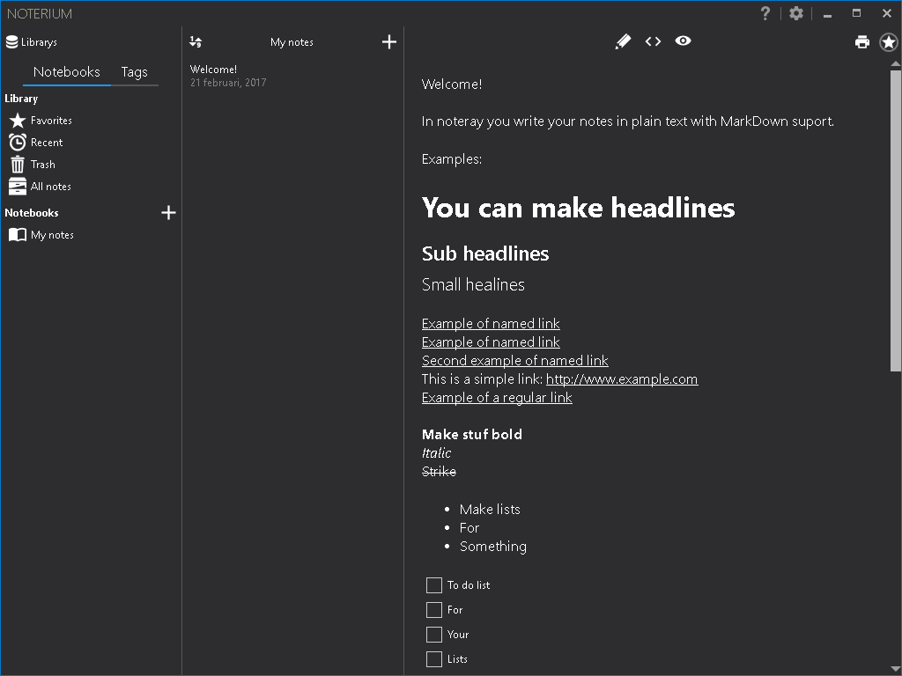
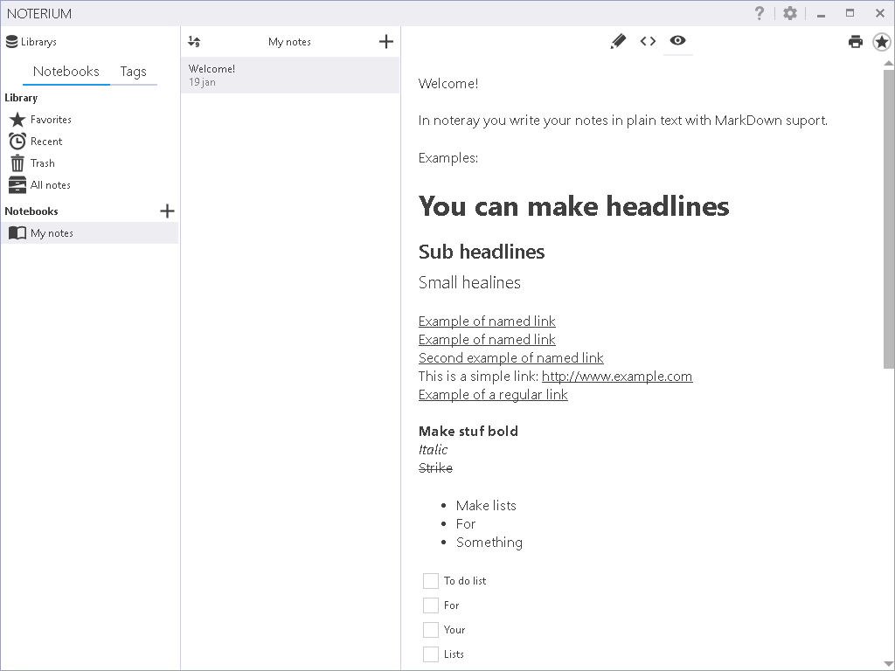

##Noteray

A little helper to keep your notes organized.

##Features

- Write notes in Markdown
- Multiple librarys (e.g. one private and one for your work)
- Secure your notes with encryption (using https://gist.github.com/4336842)
- Light and Dark theme
- Search all notes (inluding secure notes)
- Do todo-lists
- It's all backed upp daily (if you want)

## Contributing to this project

Did you stumble upon a bug? Before reporting it to us, please check out the [FAQ](https://github.com/MahApps/MahApps.Metro/wiki/FAQ) to see if it is actually a bug. If you can not find anything related to your issue, feel free to report it to us in the issue tracker.

If you've improved Noterium and think that other people would enjoy it, submit a pull request. Anyone and everyone is welcome to contribute.

Please take a moment to review the [guidelines for contributing](.github/CONTRIBUTING.md).

* [Bug reports](.github/CONTRIBUTING.md#bugs)
* [Feature requests](.github/CONTRIBUTING.md#features)
* [Pull requests](.github/CONTRIBUTING.md#pull-requests)

You need [Visual Studio 2015 Community Edition](<https://www.visualstudio.com/>) to build the solution.

##Thanks to

The team behind MahApps.Metro (https://github.com/MahApps/MahApps.Metro)

And to @punker76 for https://github.com/punker76/gong-wpf-dragdrop

And https://github.com/ekblom/Markdown.XAML that i have been extending to fit my needs.

## Licence

[MIT License (MIT)](./LICENSE)
